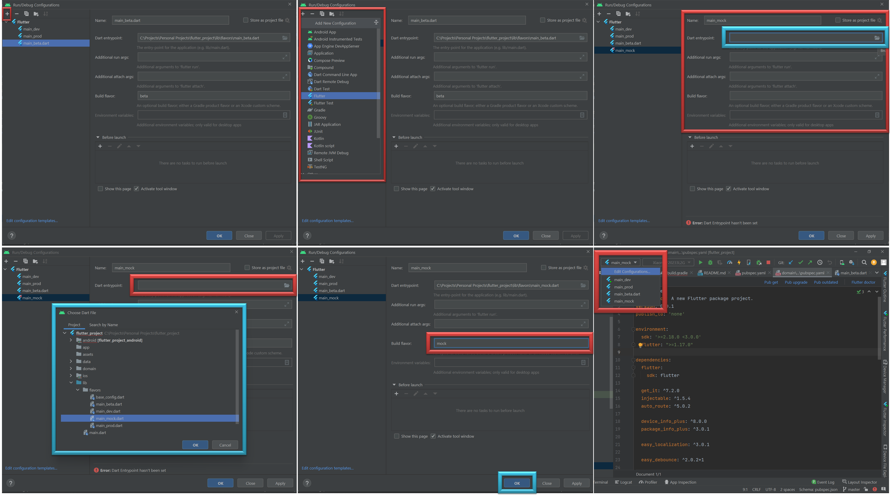
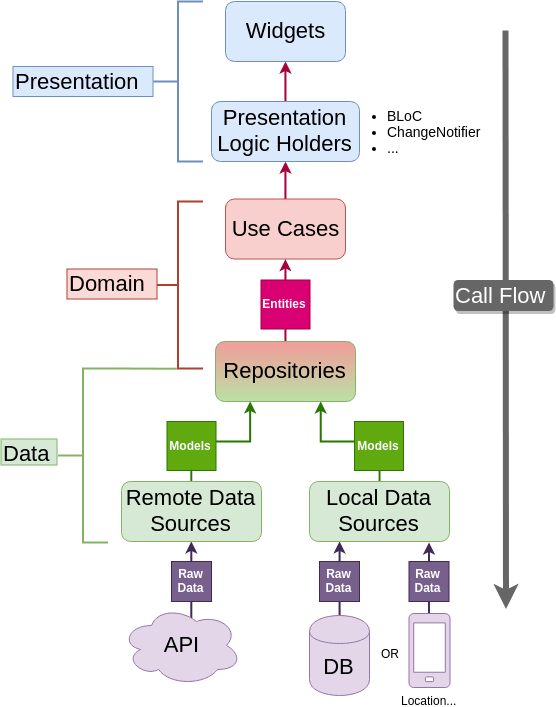

# Clean Architecture

> TDD | Service Locator | Flavors | Local Packages | BLoC | GetIt | Injectable
 
<h4>

  
  Melos  

             dart pub global activate melos 
  (https://mediaum.com/flutter-community/managing-multi-package-flutter-projects-with-melos-c8ce96fa7c82)

</h4>

<h4>

  
  Injectable  

             flutter pub run build_runner watch --delete-conflicting-outputs
             flutter pub run build_runner build --delete-conflicting-outputs
  (https://blog.logrocket.com/dependency-injection-flutter-using-getit-injectable/)
  (https://rodrigolmti.medium.com/flutter-di-a-true-love-story-1e5a5ae2ba2d)

</h4>

<h4>

  
  Create Package  

             flutter create --template=package PACKAGENAME
  (https://blog.logrocket.com/how-to-create-dart-packages-for-flutter/)
  (https://medium.com/vijay-r/creating-local-package-in-flutter-9ea89c3b8361)

</h4>

<h4>

  
  Create Flavors [IOS]  

      <-- Need to work with XCode -->

</h4>

<h4>

  
  Create Flavors [Android]  

  -> android/app/build.gradle :

         <-- Add following lines inside android{} -->
            android {
              ...
              flavorDimensions "flavor-type"
            
              productFlavors {
                prod {
                  dimension "flavor-type"
                  applicationId "com.example.flutter_project"
                  resValue "string", "app_name", "Clean Architecture"
                }
                beta {
                  dimension "flavor-type"
                  applicationId "com.example.flutter_project.beta"
                  resValue "string", "app_name", "Clean Architecture.beta"
                }
                dev {
                  dimension "flavor-type"
                  applicationId "com.example.flutter_project.dev"
                  resValue "string", "app_name", "Clean Architecture.dev"
                }
                mock {
                  dimension "flavor-type"
                  applicationId "com.example.flutter_project.mock"
                  resValue "string", "app_name", "Clean Architecture.mock"
                }
              }
            }

  -> android/app/src :

         <-- Create the following files -->

            android/app/src/prod 

            android/app/src/beta
            
            android/app/src/dev
            
            android/app/src/mock
         
         <-- Copy the following file "android/app/src/main/res" -->
         
         <-- Paste the copied file to each file we've created -->

  

</h4>
  

<h4>

  
  TDD  

  

</h4>

